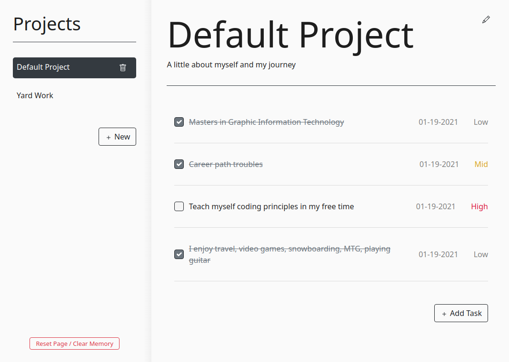

# To Do List Webapp
A to-do list that that displays projects and their tasks for your own personal to-do list. Robust features (described below) and minimal display to keep your tasks clean and organized.

I also messed around with using Bootstrap framework

Note: Adding a task, to-do, or clicking any buttons will store a tiny amount of data in your local storage as to keep track of your personal tasks without a login. I've included a reset/clear button at the bottom of the projects to clear everything if desired.

[Check it](https://jmilll.github.io/todo-list/)

## Example

[Check it](https://jmilll.github.io/todo-list/)

## Features

* Webpack Bundle
* Bootstrap elements
* Personal to-do list that will remember projects and tasks after closing the page.
* Minimal design with interactive elements.
* Option to edit project title and description.
* Option to add tasks ("to-do's").
* Set a "complete by" date.
* Set a priority level.
* Checking a task as complete has visual feedback.
* Option to delete projects.
* Option to reset and clear local storage memory.

## Motivation

The purpose of this project was to work on using SOLID principles to organize code in a modular system, seperating application logic. 

## Technologies Used

* Webpack
* Bootstrap
* JavaScript
* HTML / CSS
* Flexbox

## Acknowledgements

This project was inspired by [The Odin Project](https://www.theodinproject.com/courses/javascript/lessons/todo-list) online learning curriculum.

## License

MIT